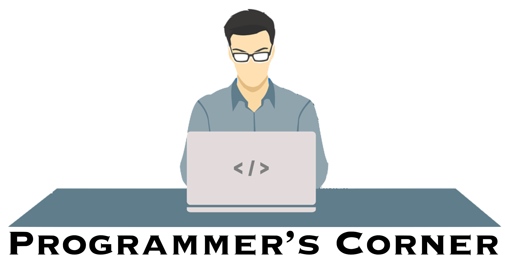

The Programmer's Corner, sponsored by the [Bioinformatics User Forum](https://abcsfrederick.info/BUF), is a quarterly meeting of programmers to discuss topics of interest to the group. We usually have 2 or 3 short talks centered around a common topic, followed by discussion.

## Upcoming Programmer's Corner Meetings

<ul>
    {{'now' | date: '%s'}}
    
    
        {{ post.date | date: '%s' }}
        
            <li>
                <a href="{{ site.baseurl }}{{ post.url }}">{{ post.date | date: "%-d %B %Y"}}, {{ post.title }}</a>
            </li>
        
    
    
</ul>

## Previous Programmer's Corner Meetings

<ul>
    {{'now' | date: '%s'}}
    
    
        {{ post.date | date: '%s' }}
        
            <li>
                <a href="{{ site.baseurl }}{{ post.url }}">{{ post.date | date: "%-d %B %Y"}}, {{ post.title }}</a>
            </li>
        
    
    
</ul>
