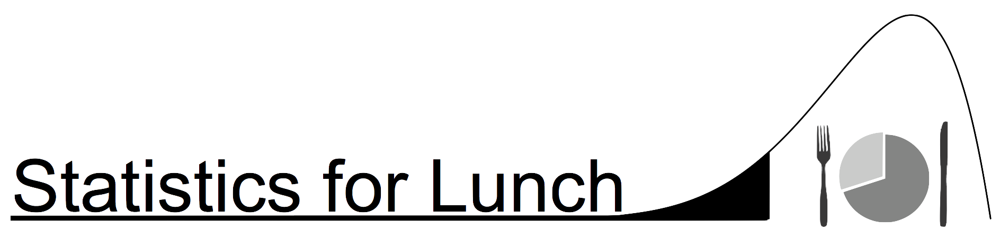

Statistics for Lunch is a series sponsored by the [Bioinformatics User Forum](BUF) that focuses on exporing topics in statistics at an accessible, intuitive level. We usually provide a high level, easy to understand seminar followed by a practical, hands-on session to practice what is covered in the seminar.

## Upcoming Statistics for Lunch Seminars

<ul>
    {{'now' | date: '%s'}}
    
    
        {{ post.date | date: '%s' }}
        
            <li>
                <a href="{{ site.baseurl }}{{ post.url }}">{{ post.date | date: "%-d %B %Y"}}, {{ post.title }}</a>
            </li>
        
    
    
</ul>

## Previous Statistics for Lunch Seminars

<ul>
    {{'now' | date: '%s'}}
    
    
        {{ post.date | date: '%s' }}
        
            <li>
                <a href="{{ site.baseurl }}{{ post.url }}">{{ post.date | date: "%-d %B %Y"}}, {{ post.title }}</a>
            </li>
        
    
    
</ul>
